# Agent de Exames - Documentação de Implementação

## 📋 Resumo
Este documento descreve a implementação do **Agent de Exames**, um agente de IA que auxilia na interpretação de exames laboratoriais através do upload de arquivos PDF.

**Data de Implementação:** 2025-10-05  
**Autor:** Sistema MedX

---

## 🎯 Funcionalidades

### 1. Upload de Exames
- ✅ Upload de arquivos PDF (máximo 10MB)
- ✅ Validação de formato e tamanho
- ✅ Interface drag-and-drop amigável
- ✅ Remoção de arquivo selecionado

### 2. Análise Inteligente
- ✅ Envio do PDF para webhook: `https://webhook.n8nlabz.com.br/webhook/agent-exame`
- ✅ Processamento e interpretação dos resultados
- ✅ Identificação de valores encontrados
- ✅ Detecção de valores alterados
- ✅ Interpretação clínica
- ✅ Recomendações médicas

### 3. Vinculação ao Prontuário
- ✅ Seleção de paciente
- ✅ Salvamento da análise no prontuário
- ✅ Registro completo com input/output
- ✅ Metadados do arquivo anexado

### 4. Exibição de Resultados
- ✅ Análise geral formatada
- ✅ Lista de valores encontrados
- ✅ Alertas para valores alterados
- ✅ Interpretação clínica detalhada
- ✅ Recomendações específicas
- ✅ Observações adicionais

---

## 🗄️ Estrutura do Banco de Dados

### Migration: `9º_Migration_add_exam_fields_agent_consultations.sql`

Campos adicionados à tabela `agent_consultations`:

```sql
-- Campos específicos para exames
exam_type TEXT                    -- Tipo de exame (laboratory, imaging, etc)
exam_result_summary TEXT          -- Resumo do resultado do exame
exam_file_name TEXT               -- Nome do arquivo analisado
exam_analysis_date TIMESTAMPTZ    -- Data da análise
```

### Índices Criados
- `idx_agent_consultations_exam_type` - Busca por tipo de exame
- `idx_agent_consultations_exam_analysis_date` - Busca por data de análise

---

## 📝 Formato de Dados

### Input (Enviado ao Webhook)
```typescript
{
  file: File,           // Arquivo PDF
  filename: string      // Nome do arquivo
}
```

### Output Esperado (Resposta do Webhook)
```typescript
{
  analise: string,                    // Análise geral do exame
  valores_encontrados: string[],      // Lista de valores encontrados
  valores_alterados: string[],        // Lista de valores fora do padrão
  interpretacao: string,              // Interpretação clínica
  recomendacoes: string[],           // Recomendações médicas
  observacoes: string                // Observações adicionais
}
```

### Registro no Banco de Dados
```typescript
{
  patient_id: UUID,
  doctor_id: UUID,
  agent_type: 'exam',
  consultation_input: {
    filename: string,
    filesize: number
  },
  consultation_output: ExamData,
  exam_type: 'laboratory',
  exam_result_summary: string,
  exam_file_name: string,
  exam_analysis_date: ISO8601
}
```

---

## 🔧 Componentes Criados

### 1. `AgentExamModal.tsx`
**Localização:** `src/components/assistant/AgentExamModal.tsx`

**Responsabilidades:**
- Gerenciar upload de arquivo
- Enviar requisição ao webhook
- Processar e exibir resultados
- Vincular análise ao paciente
- Tratamento de erros

**Props:**
```typescript
interface AgentExamModalProps {
  open: boolean;
  onOpenChange: (open: boolean) => void;
}
```

**Estados Principais:**
- `selectedFile`: Arquivo PDF selecionado
- `loading`: Estado de carregamento
- `resultado`: Dados da análise
- `patients`: Lista de pacientes para vinculação

---

## 🔄 Fluxo de Funcionamento

```mermaid
graph TD
    A[Usuário clica em Agent de Exames] --> B[Modal Abre]
    B --> C[Usuário seleciona PDF]
    C --> D{Arquivo Válido?}
    D -->|Não| E[Exibe Erro]
    D -->|Sim| F[Usuário clica em Analisar]
    F --> G[Envia para Webhook]
    G --> H{Resposta OK?}
    H -->|Não| I[Exibe Erro]
    H -->|Sim| J[Processa Resposta]
    J --> K[Exibe Resultados]
    K --> L{Vincular ao Paciente?}
    L -->|Sim| M[Seleciona Paciente]
    M --> N[Salva no Banco]
    N --> O[Confirmação]
    L -->|Não| P[Usuário fecha modal]
```



---

## ⚠️ Validações Implementadas

### Upload de Arquivo
- ✅ Formato: Apenas PDF (`application/pdf`)
- ✅ Tamanho: Máximo 10MB
- ✅ Existência: Arquivo deve estar selecionado

### Vinculação ao Paciente
- ✅ Paciente deve ser selecionado
- ✅ Resultado da análise deve existir
- ✅ Usuário deve estar autenticado

### Tratamento de Erros
- ✅ Erro de rede/timeout
- ✅ Formato de resposta inválido
- ✅ Erro ao salvar no banco
- ✅ Arquivo inválido

---

## 🎨 Interface do Usuário

### Tela Inicial
- Card do Agent de Exames na grade de agents
- Ícone: Microscope (🔬)
- Cor: Orange/Amber gradient

### Modal de Upload
- Área de upload drag-and-drop
- Preview do arquivo selecionado
- Botões: Cancelar, Analisar

### Modal de Resultados
- Análise geral destacada
- Valores encontrados (azul)
- Valores alterados (amarelo/alerta)
- Interpretação clínica (roxo)
- Recomendações (verde)
- Observações (cinza)
- Opção de vincular ao paciente
- Botões: Fechar, Nova Análise

---

## 🔐 Segurança e Permissões

### RLS (Row Level Security)
Utiliza as políticas existentes da tabela `agent_consultations`:

- **SELECT:** Médicos, owners e secretários podem visualizar
- **INSERT:** Médicos e owners podem criar registros
- **UPDATE:** Médicos podem atualizar suas consultas, owners todas
- **DELETE:** Apenas owners podem deletar

### Validações Frontend
- Verificação de tipo de arquivo
- Limitação de tamanho
- Verificação de autenticação
- Validação de paciente selecionado

---

## 📊 Integração com Timeline

As análises de exames ficam disponíveis no **Timeline do Paciente**, junto com:
- Consultas CID
- Cálculos de medicação
- Outros eventos do prontuário

Exibição no Timeline:
```typescript
{
  type: 'agent_consultation',
  agent_type: 'exam',
  title: 'Análise de Exame',
  exam_file_name: string,
  exam_result_summary: string,
  date: ISO8601
}
```

---

## 🧪 Como Testar

### 1. Teste Básico
```
1. Acesse página "Assistente"
2. Clique no card "Agent de Exames"
3. Selecione um PDF de exame
4. Clique em "Analisar Exame"
5. Verifique resultado exibido
```

### 2. Teste de Vinculação
```
1. Execute teste básico
2. Clique em "Vincular a um Paciente"
3. Selecione um paciente
4. Clique em "Confirmar Vinculação"
5. Verifique toast de sucesso
6. Abra o prontuário do paciente
7. Verifique no Timeline
```

### 3. Teste de Validação
```
1. Tente enviar sem arquivo → Erro
2. Tente enviar arquivo não-PDF → Erro
3. Tente enviar arquivo > 10MB → Erro
4. Verifique mensagens de erro apropriadas
```

---

## 🚀 Melhorias Futuras

### Funcionalidades Adicionadas (Possíveis)
- [ ] Suporte para múltiplos tipos de arquivo (JPEG, PNG para imagens)
- [ ] Upload de múltiplos exames de uma vez
- [ ] Comparação entre exames do mesmo paciente
- [ ] Gráficos de evolução dos resultados
- [ ] Export dos resultados em PDF
- [ ] OCR para exames escaneados de baixa qualidade
- [ ] Detecção automática do tipo de exame
- [ ] Integração com banco de dados de valores de referência personalizados

### Otimizações
- [ ] Compressão de PDFs antes do envio
- [ ] Cache de resultados frequentes
- [ ] Preview do PDF antes do envio
- [ ] Progress bar durante upload
- [ ] Retry automático em caso de falha

---

## 📞 Suporte

Em caso de problemas:
1. Verifique console do navegador para erros
2. Verifique logs do webhook no n8n
3. Confirme que a migration foi executada
4. Verifique permissões RLS no Supabase

---

## 📄 Arquivos Relacionados

### Código Fonte
- `src/components/assistant/AgentExamModal.tsx` - Componente principal
- `src/pages/Assistant.tsx` - Integração na página

### Banco de Dados
- `migrations/7º_Migration_create_agent_consultations.sql` - Tabela base
- `migrations/9º_Migration_add_exam_fields_agent_consultations.sql` - Campos de exames

### Documentação
- `docs/database/migration-notes/README_AGENT_EXAMS.md` - Este arquivo

---

## ✅ Checklist de Implementação

- [x] Componente AgentExamModal criado
- [x] Integração na página Assistant
- [x] Migration para campos de exames
- [x] Validação de upload
- [x] Envio para webhook
- [x] Processamento de resposta
- [x] Exibição de resultados
- [x] Vinculação ao paciente
- [x] Tratamento de erros
- [x] Documentação completa

---

**Status:** ✅ Implementado e Funcional  
**Versão:** 1.0.0  
**Última Atualização:** 2025-10-05

