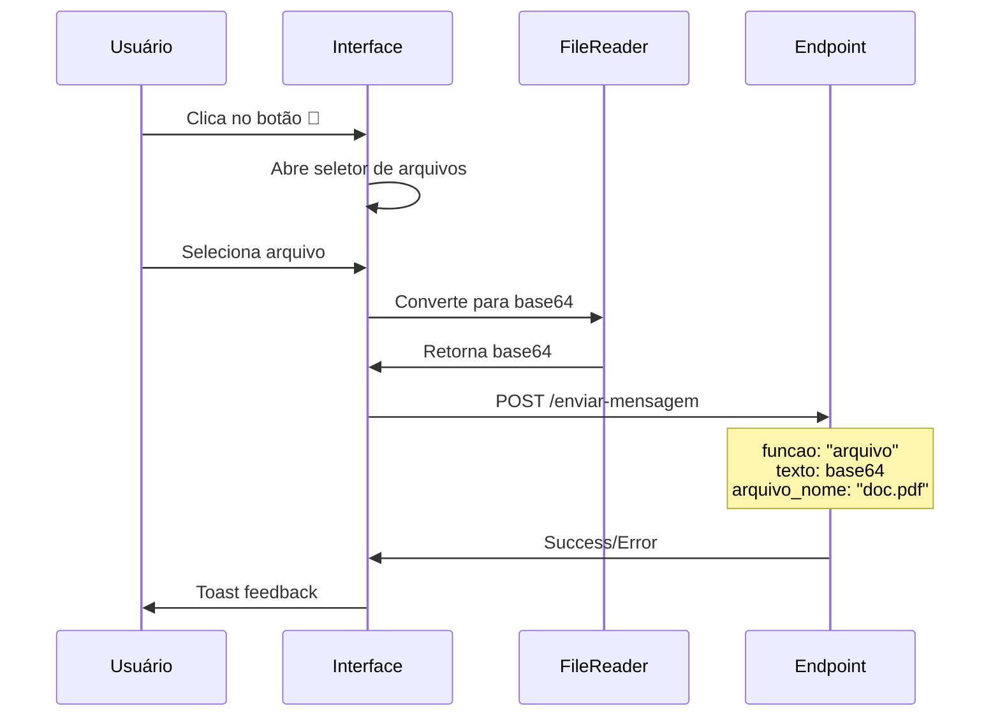

-- Descrição: Implementação de upload de arquivos com conversão para base64 no menu WhatsApp
-- Data: 2025-10-11
-- Autor: Sistema MedX

# 📎 Implementação: Upload de Arquivo com Base64

## 📋 Visão Geral

Implementado sistema de upload de arquivos que:
1. ✅ Abre seletor de arquivos ao clicar no botão 📎
2. ✅ Converte o arquivo para base64
3. ✅ Envia para o mesmo endpoint `/enviar-mensagem`
4. ✅ Adiciona campo `funcao`: `"text"` | `"audio"` | `"arquivo"`

---

## 🔧 Funcionalidades Implementadas

### 1. Seletor de Arquivos

**Input file oculto:**
```tsx
<input
  ref={fileInputRef}
  type="file"
  accept="image/*,.pdf,.doc,.docx,.xls,.xlsx,.txt"
  onChange={handleFileSelected}
  style={{ display: 'none' }}
/>
```

**Tipos de arquivo aceitos:**
- 🖼️ Imagens: `image/*` (JPG, PNG, GIF, WebP, etc.)
- 📄 PDF: `.pdf`
- 📝 Word: `.doc`, `.docx`
- 📊 Excel: `.xls`, `.xlsx`
- 📃 Texto: `.txt`

### 2. Conversão para Base64

**Função auxiliar:**
```typescript
const fileToBase64 = (file: File): Promise<string> => {
  return new Promise((resolve, reject) => {
    const reader = new FileReader();
    reader.readAsDataURL(file);
    reader.onload = () => {
      if (typeof reader.result === 'string') {
        // Remover o prefixo "data:tipo/mime;base64,"
        const base64 = reader.result.split(',')[1];
        resolve(base64);
      } else {
        reject(new Error('Erro ao converter arquivo'));
      }
    };
    reader.onerror = (error) => reject(error);
  });
};
```

**O que faz:**
- Lê o arquivo usando FileReader
- Converte para DataURL
- Remove o prefixo `data:image/png;base64,`
- Retorna apenas o base64 puro

### 3. Validações

**Tamanho máximo: 10MB**
```typescript
const maxSize = 10 * 1024 * 1024; // 10MB
if (file.size > maxSize) {
  toast.error('Arquivo muito grande. Tamanho máximo: 10MB');
  return;
}
```

### 4. Função de Envio Refatorada

**Assinatura atualizada:**
```typescript
const handleSendMessage = async (
  funcao: 'text' | 'audio' | 'arquivo' = 'text',
  fileBase64?: string,
  fileName?: string
) => {
  // Lógica de envio...
}
```

**Validações por tipo:**
```typescript
// Validar texto
if (funcao === 'text' && !messageText.trim()) {
  toast.error('Digite uma mensagem antes de enviar');
  return;
}

// Validar arquivo/áudio
if ((funcao === 'arquivo' || funcao === 'audio') && !fileBase64) {
  toast.error('Nenhum arquivo selecionado');
  return;
}
```

---

## 📡 Estrutura do Payload

### Payload para Mensagem de Texto

```json
{
  "session_id": "dc435ef1-9959-41dc-a67d-7d8da27d6dd8",
  "numero_paciente": "5519994419319",
  "texto": "Olá! Como posso ajudar?",
  "nome_login": "Maria Silva",
  "funcao": "text"
}
```

### Payload para Arquivo

```json
{
  "session_id": "dc435ef1-9959-41dc-a67d-7d8da27d6dd8",
  "numero_paciente": "5519994419319",
  "texto": "iVBORw0KGgoAAAANSUhEUgAAAAUA...",  // Base64 do arquivo
  "nome_login": "Maria Silva",
  "funcao": "arquivo",
  "arquivo_nome": "documento.pdf"
}
```

### Payload para Áudio (Futuro)

```json
{
  "session_id": "dc435ef1-9959-41dc-a67d-7d8da27d6dd8",
  "numero_paciente": "5519994419319",
  "texto": "//uQxAAAAAAAAAAAAAAAAAAAA...",  // Base64 do áudio
  "nome_login": "Maria Silva",
  "funcao": "audio",
  "arquivo_nome": "audio_1234567890.webm"
}
```

---

## 🔄 Fluxo de Upload



---

## 📋 Logs de Debug

### Ao Clicar no Botão

```javascript
[WhatsApp] 📎 Botão de anexar arquivo clicado
```

### Ao Selecionar Arquivo

```javascript
[WhatsApp] 📎 Arquivo selecionado: {
  name: "documento.pdf",
  type: "application/pdf",
  size: "2048.50 KB"
}
```

### Após Conversão

```javascript
[WhatsApp] ✅ Arquivo convertido para base64: {
  tamanho_original: 2097664,
  tamanho_base64: 2796885,
  nome: "documento.pdf"
}
```

### Ao Enviar

```javascript
📤 Enviando mensagem via WhatsApp: {
  session_id: "dc435ef1-9959-41dc-a67d-7d8da27d6dd8",
  numero_paciente: "5519994419319",
  numero_original: "5519994419319@s.whatsapp.net",
  funcao: "arquivo",
  texto: "[arquivo] documento.pdf",
  nome_login: "Maria Silva",
  arquivo_nome: "documento.pdf"
}

📦 Payload completo: {
  session_id: "dc435ef1-9959-41dc-a67d-7d8da27d6dd8",
  numero_paciente: "5519994419319",
  texto: "iVBORw0KGgoAAAANSUhEUgAAAAUA...",
  nome_login: "Maria Silva",
  funcao: "arquivo",
  arquivo_nome: "documento.pdf"
}
```

---

## 🎯 Comportamento do Sistema

### Cenário 1: Upload Bem-Sucedido

1. Usuário clica no botão 📎
2. Seletor de arquivos abre
3. Usuário escolhe um arquivo (ex: `relatorio.pdf`)
4. Sistema mostra toast: `ℹ️ Convertendo arquivo...`
5. Arquivo é convertido para base64
6. Sistema mostra spinner no botão de anexo
7. Requisição é enviada para a API
8. Sistema mostra toast: `✅ Mensagem enviada com sucesso!`
9. Input file é limpo (pode selecionar novamente)

### Cenário 2: Arquivo Muito Grande

1. Usuário seleciona arquivo > 10MB
2. Sistema mostra toast: `❌ Arquivo muito grande. Tamanho máximo: 10MB`
3. Upload é cancelado
4. Usuário pode tentar outro arquivo

### Cenário 3: Erro na Conversão

1. Erro ao ler arquivo
2. Sistema mostra toast: `❌ Erro ao processar arquivo. Tente novamente.`
3. Loading state é desativado
4. Input file é limpo

### Cenário 4: Erro na API

1. Arquivo convertido com sucesso
2. API retorna erro (4xx, 5xx)
3. Sistema mostra toast com mensagem de erro
4. Loading state é desativado
5. Input file é limpo

---

## 🔐 Validações Implementadas

### 1. Conversa Selecionada

```typescript
if (!selectedSessionId) {
  toast.error('Selecione uma conversa primeiro');
  return;
}
```

### 2. Tamanho do Arquivo

```typescript
const maxSize = 10 * 1024 * 1024; // 10MB
if (file.size > maxSize) {
  toast.error('Arquivo muito grande. Tamanho máximo: 10MB');
  return;
}
```

### 3. Telefone do Paciente

```typescript
if (!patientPhone || patientPhone.trim() === '') {
  toast.error('Paciente não possui número de telefone cadastrado');
  return;
}
```

### 4. Usuário Autenticado

```typescript
if (!user?.name) {
  toast.error('Usuário não identificado. Faça login novamente.');
  return;
}
```

---

## 🎨 Feedback Visual

### Toasts Implementados

| Situação | Mensagem | Tipo |
|----------|----------|------|
| Conversão iniciada | `Convertendo arquivo...` | Info |
| Arquivo muito grande | `Arquivo muito grande. Tamanho máximo: 10MB` | Error |
| Erro ao processar | `Erro ao processar arquivo. Tente novamente.` | Error |
| Sem conversa | `Selecione uma conversa primeiro` | Error |
| Sem telefone | `Paciente não possui número de telefone cadastrado` | Error |
| Envio bem-sucedido | `Mensagem enviada com sucesso!` | Success |
| Erro na API | `[Mensagem específica do erro]` | Error |

### Loading States

```typescript
// Durante conversão e envio
setSending(true);

// Botões desabilitados:
- 📎 Botão de anexar
- 🎤 Botão de áudio
- 💬 Input de texto
- 📤 Botão de enviar (mostra spinner)
```

---

## 🧪 Como Testar

### Teste 1: Upload de Imagem

1. Recarregue a página (Ctrl+R)
2. Selecione uma conversa
3. Clique no botão 📎
4. Selecione uma imagem (ex: `foto.jpg`)
5. Observe o console:
   ```
   [WhatsApp] 📎 Arquivo selecionado: { name: "foto.jpg", ... }
   [WhatsApp] ✅ Arquivo convertido para base64: { ... }
   📤 Enviando mensagem via WhatsApp: { funcao: "arquivo", ... }
   ```
6. Verifique se a API recebeu o base64

### Teste 2: Upload de PDF

1. Clique no botão 📎
2. Selecione um PDF (ex: `relatorio.pdf`)
3. Observe o console
4. Verifique o payload enviado

### Teste 3: Arquivo Muito Grande

1. Selecione um arquivo > 10MB
2. Deve aparecer toast de erro
3. Upload NÃO deve ser iniciado

### Teste 4: Múltiplos Uploads

1. Envie um arquivo
2. Aguarde conclusão
3. Envie outro arquivo
4. Ambos devem funcionar

---

## 📊 Comparação Antes/Depois

| Aspecto | Antes | Depois |
|---------|-------|--------|
| **Seletor de arquivo** | ❌ Não existia | ✅ Funcional |
| **Conversão base64** | ❌ Não existia | ✅ Implementada |
| **Campo `funcao`** | ❌ Não enviado | ✅ Enviado (`text`, `arquivo`, `audio`) |
| **Validação de tamanho** | ❌ Não existia | ✅ Máximo 10MB |
| **Logs de debug** | ❌ Básicos | ✅ Detalhados |
| **Feedback visual** | ❌ Toast simples | ✅ Toasts específicos |
| **Tipos de arquivo** | ❌ N/A | ✅ Imagens, PDF, DOC, XLS, TXT |

---

## 🚀 Próximos Passos

### Backend (N8N)

O endpoint `/enviar-mensagem` precisa:

1. **Identificar o tipo de mensagem** pelo campo `funcao`:
   ```javascript
   const { funcao, texto, arquivo_nome } = req.body;
   
   if (funcao === 'text') {
     // Enviar mensagem de texto normal
     await sendTextMessage(numero_paciente, texto);
   } else if (funcao === 'arquivo') {
     // Decodificar base64 e enviar como arquivo
     const buffer = Buffer.from(texto, 'base64');
     await sendFileMessage(numero_paciente, buffer, arquivo_nome);
   } else if (funcao === 'audio') {
     // Decodificar base64 e enviar como áudio
     const buffer = Buffer.from(texto, 'base64');
     await sendAudioMessage(numero_paciente, buffer);
   }
   ```

2. **Salvar o arquivo no servidor (opcional)**:
   ```javascript
   const fs = require('fs');
   const filePath = `/tmp/${arquivo_nome}`;
   fs.writeFileSync(filePath, buffer);
   ```

3. **Enviar via WhatsApp API**:
   ```javascript
   // Usando biblioteca do WhatsApp
   await whatsapp.sendFile(numero_paciente, filePath);
   ```

### Frontend (Melhorias Futuras)

1. **Preview do arquivo antes de enviar**
2. **Progress bar de conversão/upload**
3. **Drag & drop de arquivos**
4. **Paste de imagem do clipboard**
5. **Compressão de imagens grandes**
6. **Thumbnail de imagens enviadas**

---

## 📝 Arquivos Modificados

### `src/pages/WhatsApp.tsx`

**Imports:**
```typescript
import { useRef } from 'react';
```

**Estados:**
```typescript
const fileInputRef = useRef<HTMLInputElement>(null);
```

**Funções adicionadas:**
- `fileToBase64()` - Converte arquivo para base64
- `handleFileSelected()` - Handler de seleção de arquivo
- `handleSendMessage()` - Refatorada para suportar 3 tipos

**JSX adicionado:**
```tsx
<input ref={fileInputRef} type="file" ... />
```

**Total de linhas modificadas:** ~150 linhas

---

## ✅ Checklist de Implementação

- [x] Criar ref para input file
- [x] Adicionar input file oculto no JSX
- [x] Implementar função de conversão base64
- [x] Criar handler de seleção de arquivo
- [x] Validar tamanho do arquivo
- [x] Atualizar função handleSendMessage
- [x] Adicionar campo `funcao` no payload
- [x] Implementar logs detalhados
- [x] Adicionar toasts de feedback
- [x] Limpar input após envio
- [x] Desabilitar botões durante envio
- [x] Testar com diferentes tipos de arquivo

---

## 🎯 Resultado Final

### Payload Enviado

**Mensagem de texto:**
```json
{
  "session_id": "uuid",
  "numero_paciente": "5519994419319",
  "texto": "Olá!",
  "nome_login": "Maria Silva",
  "funcao": "text"
}
```

**Arquivo (base64):**
```json
{
  "session_id": "uuid",
  "numero_paciente": "5519994419319",
  "texto": "JVBERi0xLjQKJeLjz9MKNCAwIG9iag...",
  "nome_login": "Maria Silva",
  "funcao": "arquivo",
  "arquivo_nome": "documento.pdf"
}
```

---

**Implementação concluída em:** 2025-10-11  
**Status:** ✅ Pronto para Teste  
**Próximo passo:** Configurar backend para receber e processar arquivos base64

