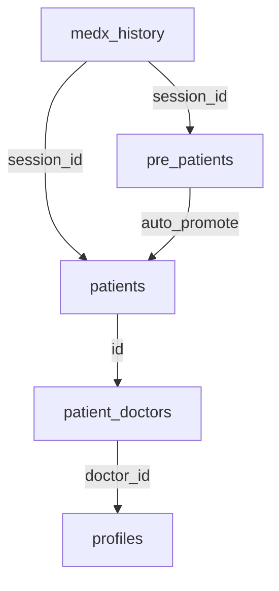
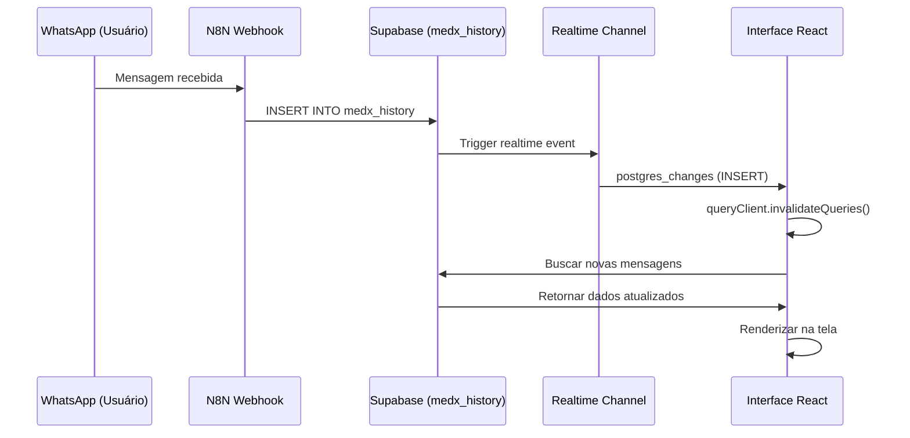
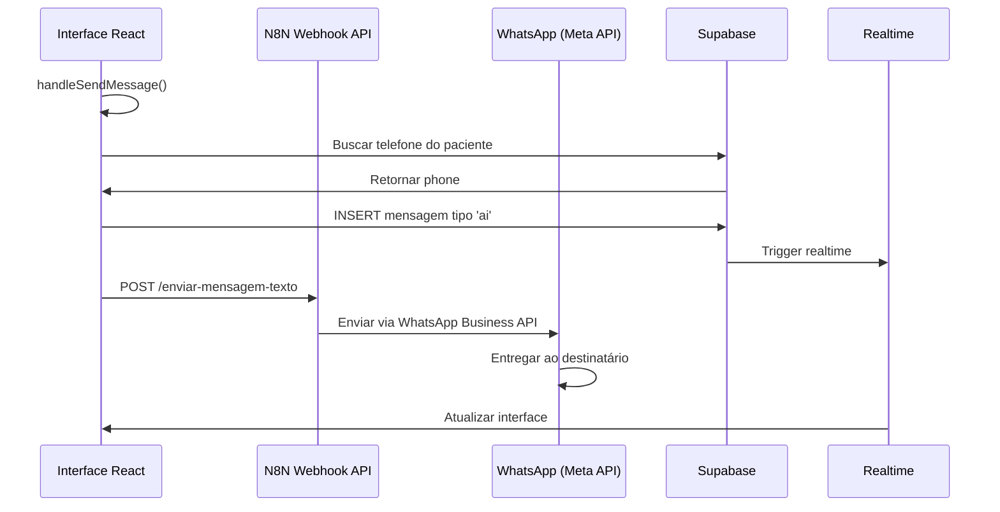

# 📱 Análise Completa do Menu WhatsApp - Sistema MedX

**Data:** 2025-10-11  
**Autor:** Sistema MedX - Análise Técnica Profunda  
**Versão:** 1.0  

---

## 📋 Índice

1. [Visão Geral do Sistema](#1-visão-geral-do-sistema)
2. [Arquitetura de Dados](#2-arquitetura-de-dados)
3. [Design da Interface](#3-design-da-interface)
4. [Fluxo de Mensagens](#4-fluxo-de-mensagens)
5. [Estado Atual da Barra de Mensagens](#5-estado-atual-da-barra-de-mensagens)
6. [Integração com API Externa](#6-integração-com-api-externa)
7. [Sistema de Realtime](#7-sistema-de-realtime)
8. [Análise de Segurança e Permissões](#8-análise-de-segurança-e-permissões)
9. [Recomendações para Implementação](#9-recomendações-para-implementação)

---

## 1. Visão Geral do Sistema

### 1.1 Propósito do Menu WhatsApp

O menu WhatsApp é um **hub centralizado de comunicação** que permite à equipe médica e secretariado:

- 📨 Visualizar todas as conversas do WhatsApp em tempo real
- 👥 Distinguir entre **Pré-Pacientes** (leads) e **Pacientes CRM** (cadastrados)
- 🩺 Atribuir médicos responsáveis por cada conversa
- 📊 Gerar resumos inteligentes com IA (Gemini)
- 📝 Visualizar histórico completo de mensagens
- 🔄 Receber atualizações em tempo real via Supabase Realtime
- **📤 ENVIAR MENSAGENS** *(funcionalidade a ser implementada)*

### 1.2 Tecnologias Utilizadas

| Tecnologia | Propósito | Versão |
|------------|-----------|--------|
| **React** | Framework frontend | 18+ |
| **TypeScript** | Tipagem estática | 5+ |
| **Supabase** | Backend-as-a-Service (PostgreSQL) | Latest |
| **TanStack Query** | Cache e gerenciamento de estado assíncrono | v5 |
| **shadcn/ui** | Biblioteca de componentes UI | Latest |
| **Tailwind CSS** | Estilização | Latest |
| **dayjs** | Manipulação de datas | Latest |
| **N8N Webhook** | API externa para envio de mensagens | Custom |

---

## 2. Arquitetura de Dados

### 2.1 Tabela `medx_history`

**Estrutura completa:**

```sql
CREATE TABLE public.medx_history (
  id SERIAL PRIMARY KEY,
  session_id TEXT NOT NULL,           -- UUID do paciente/pré-paciente
  message JSONB NOT NULL,             -- Objeto com tipo e conteúdo da mensagem
  data_e_hora TIMESTAMPTZ NOT NULL DEFAULT NOW(),  -- Timestamp UTC
  media TEXT NULL                     -- URL de mídia (imagem, áudio, PDF, etc.)
);

-- Índices (inferidos)
CREATE INDEX idx_medx_history_session_id ON medx_history(session_id);
CREATE INDEX idx_medx_history_data_e_hora ON medx_history(data_e_hora DESC);
```

**Campos detalhados:**

| Campo | Tipo | Descrição | Exemplo |
|-------|------|-----------|---------|
| `id` | SERIAL | Identificador único da mensagem | `1234` |
| `session_id` | TEXT | UUID que identifica a conversa (mesmo ID do paciente/pré-paciente) | `"550e8400-e29b-41d4-a716-446655440000"` |
| `message` | JSONB | Estrutura `{ type: 'human' \| 'ai', content: string \| array }` | `{"type":"human","content":"Olá"}` |
| `data_e_hora` | TIMESTAMPTZ | Data/hora em UTC (exibida em -03:00 no app) | `2025-10-11 14:30:00+00` |
| `media` | TEXT | URL pública de mídia hospedada | `"https://storage.supabase.co/..."` |

### 2.2 Estrutura do Campo `message`

**Formato 1: Mensagem de texto simples**
```json
{
  "type": "human",
  "content": "Olá, gostaria de agendar uma consulta"
}
```

**Formato 2: Mensagem de IA**
```json
{
  "type": "ai",
  "content": "Claro! Posso te ajudar com isso."
}
```

**Formato 3: Mensagem com array de conteúdo**
```json
{
  "type": "human",
  "content": [
    { "text": "Aqui está meu exame" },
    { "type": "image", "url": "..." }
  ]
}
```

### 2.3 Relacionamento com Outras Tabelas



**Detalhamento:**

- `medx_history.session_id` pode corresponder a:
  - **`patients.id`** → Paciente cadastrado no CRM
  - **`pre_patients.id`** → Lead/pré-paciente (sem cadastro completo)
  - **Nenhum** → Conversa não classificada (caso raro)

- Quando um pré-paciente é promovido:
  - O `session_id` permanece o mesmo (UUID preservado)
  - Todas as mensagens históricas são mantidas
  - Registro migra de `pre_patients` para `patients`

---

## 3. Design da Interface

### 3.1 Layout Geral

```
┌─────────────────────────────────────────────────────────────┐
│  Dashboard (DashboardLayout)                                │
│  ┌───────────────────────────────────────────────────────┐  │
│  │  Card                                                  │  │
│  │  ┌──────────────┬──────────────────────────────────┐  │  │
│  │  │  Sidebar     │  Painel de Mensagens             │  │  │
│  │  │  (340px)     │  (flex-1)                        │  │  │
│  │  │              │                                   │  │  │
│  │  │  [Abas]      │  ┌──────────────────────────┐    │  │  │
│  │  │  [Busca]     │  │  Header                  │    │  │  │
│  │  │              │  ├──────────────────────────┤    │  │  │
│  │  │  [Conversas] │  │  ScrollArea (Mensagens)  │    │  │  │
│  │  │    • Conv1   │  │    • Msg 1               │    │  │  │
│  │  │    • Conv2   │  │    • Msg 2               │    │  │  │
│  │  │    • Conv3   │  │    • Msg 3               │    │  │  │
│  │  │              │  │    ...                   │    │  │  │
│  │  │              │  ├──────────────────────────┤    │  │  │
│  │  │              │  │  🔽 BARRA DE MENSAGEM 🔽 │    │  │  │
│  │  │              │  │  [Input] [Botão Enviar] │    │  │  │
│  │  │              │  └──────────────────────────┘    │  │  │
│  │  └──────────────┴──────────────────────────────────┘  │  │
│  └───────────────────────────────────────────────────────┘  │
└─────────────────────────────────────────────────────────────┘
```

### 3.2 Sidebar - Lista de Conversas

**Funcionalidades:**

1. **Abas de filtro:**
   - `Todos` - Exibe todas as conversas
   - `Pré Pacientes` - Apenas leads
   - `Pacientes CRM` - Apenas cadastrados

2. **Campo de busca:**
   - Busca por ID da sessão
   - Busca por nome do paciente
   - Busca por conteúdo da última mensagem

3. **Item de conversa:**
   ```tsx
   ┌────────────────────────────────────┐
   │ [Avatar] João Silva                │
   │          Paciente CRM              │ ← Badge de classificação
   │          Olá, gostaria de...       │ ← Preview da última mensagem
   │                              42    │ ← Total de mensagens
   └────────────────────────────────────┘
   ```

**Indicadores visuais:**

| Tipo | Cor da Borda | Cor do Avatar | Badge |
|------|--------------|---------------|-------|
| Pré-Paciente | `border-amber-400` | `bg-amber-100` | `text-amber-700` |
| Paciente CRM | `border-emerald-400` | `bg-primary/10` | `text-emerald-700` |
| Desconhecido | `border-muted` | `bg-muted` | `text-slate-500` |

### 3.3 Painel de Mensagens

**Header da conversa:**

```tsx
┌────────────────────────────────────────────────────────┐
│ [Avatar] João Silva                                    │
│          42 mensagens                                  │
│          [Dr. Maria - Cardiologia] ← Médico atribuído │
│                                                        │
│          [Resumo] [Follow-up] [Atribuir Médico] ←─────┼─ Botões de ação
└────────────────────────────────────────────────────────┘
```

**Área de mensagens:**

- `ScrollArea` com rolagem vertical
- Mensagens agrupadas por dia
- Formato de chat (Human à esquerda, AI à direita)
- Suporte a mídias (imagem, áudio, vídeo, PDF, documentos)

**Bubble de mensagem:**

```tsx
// Mensagem Human (esquerda)
┌───────────────────────────┐
│ Olá, preciso de ajuda     │
│                     14:30 │ ← Hora local
└───────────────────────────┘

// Mensagem AI (direita)
                  ┌───────────────────────────┐
                  │ Claro! Como posso ajudar? │
                  │ 14:31                     │
                  └───────────────────────────┘
```

**Player de áudio especial:**

```tsx
┌─────────────────────────────────────┐
│ [▶️] ▬▬▬▬▬▬▬▬▬▬▬▬▬ [1.5x]          │
│      00:15 / 02:30                  │
│      [Exibir transcrição]           │
│      ────────────────────────────    │
│      "Texto transcrito do áudio..." │
└─────────────────────────────────────┘
```

### 3.4 Barra Inferior - Área de Digitação

**Estado Atual (linhas 595-614 do WhatsApp.tsx):**

```tsx
<div className="px-4 py-3 -mx-4 border-t bg-background/50">
  <div className="flex items-center gap-2">
    <Input
      placeholder="Digite sua mensagem..."
      value={messageText}
      onChange={(e) => setMessageText(e.target.value)}
      onKeyPress={handleKeyPress}          // Enter para enviar
      disabled={!selectedSessionId}        // Desabilitado se nenhuma conversa selecionada
      className="flex-1"
    />
    <Button
      onClick={handleSendMessage}
      disabled={!messageText.trim() || !selectedSessionId}
      size="icon"
      className="shrink-0"
    >
      <Send className="h-4 w-4" />
    </Button>
  </div>
</div>
```

**Estados:**

| Estado | Condição | Comportamento |
|--------|----------|---------------|
| **Ativo** | `selectedSessionId !== null && messageText.trim()` | Botão azul, clicável |
| **Desabilitado** | `selectedSessionId === null` | Input e botão desabilitados |
| **Vazio** | `messageText === ''` | Botão desabilitado (cinza) |

**Eventos:**

- `onChange` → Atualiza `messageText`
- `onKeyPress` → Se Enter (sem Shift), chama `handleSendMessage()`
- `onClick` → Chama `handleSendMessage()`

---

## 4. Fluxo de Mensagens

### 4.1 Recebimento de Mensagens



**Implementação no código (linhas 242-272 do WhatsApp.tsx):**

```tsx
useEffect(() => {
  const channel = supabase
    .channel('realtime:medx_history-ui')
    .on('postgres_changes', 
      { event: 'INSERT', schema: 'public', table: 'medx_history' }, 
      (payload) => {
        // Invalidar lista de sessões
        queryClient.invalidateQueries({ queryKey: ['medx_sessions'] });
        
        // Se a mensagem é da sessão atual, atualizar mensagens
        const sid = (payload.new as any)?.session_id;
        if (sid && sid === selectedSessionId) {
          queryClient.invalidateQueries({ 
            queryKey: ['medx_messages', selectedSessionId] 
          });
        }
      }
    )
    .subscribe();

  return () => {
    supabase.removeChannel(channel);
  };
}, [queryClient, selectedSessionId]);
```

### 4.2 Envio de Mensagens (A IMPLEMENTAR)

**Função atual (linhas 367-375):**

```tsx
const handleSendMessage = async () => {
  if (!messageText.trim() || !selectedSessionId) return;
  
  // TODO: Implementar lógica de envio de mensagem
  console.log('Enviando mensagem:', messageText, 'para sessão:', selectedSessionId);
  
  // Limpar campo após envio
  setMessageText('');
};
```

**Fluxo proposto:**



---

## 5. Estado Atual da Barra de Mensagens

### 5.1 O que já está pronto

✅ **Interface completa:**
- Input de texto estilizado
- Botão com ícone de envio
- Estados de habilitado/desabilitado
- Feedback visual

✅ **Estados de UI:**
- `messageText` → Controla o valor do input
- `setMessageText` → Atualiza o texto digitado
- Validações de input vazio e sessão não selecionada

✅ **Eventos de teclado:**
- Enter para enviar
- Shift+Enter para nova linha (não implementado, mas preparado)

✅ **Busca de telefone:**
- Função `fetchPhone()` já busca o telefone do paciente/pré-paciente (linhas 307-329)
- Estado `patientPhone` armazena o número

### 5.2 O que falta implementar

❌ **Lógica de envio real:**
- Integração com API de WhatsApp
- Salvamento no banco de dados
- Tratamento de erros
- Loading states

❌ **Feedback de envio:**
- Loading spinner durante envio
- Toast de sucesso/erro
- Retry em caso de falha

❌ **Otimizações:**
- Inserção otimista (mostrar mensagem antes da confirmação)
- Cache de mensagens enviadas
- Sincronização com Realtime

---

## 6. Integração com API Externa

### 6.1 Configuração de API

**Arquivo:** `src/lib/apiConfig.ts`

**Sistema de configuração dinâmica:**

- URL base armazenada em `system_settings` (tabela do banco)
- Cache de 5 minutos para performance
- Timeout configurável (padrão: 30s)

**Função principal:**

```tsx
import { getApiBaseUrl } from '@/lib/apiConfig';

const apiBaseUrl = await getApiBaseUrl();
// Retorna: "https://webhook.n8nlabz.com.br/webhook"
```

### 6.2 Endpoint de Envio de Medicação (Referência)

**Arquivo:** `src/components/assistant/SendMedicationModal.tsx` (linhas 58-70)

```tsx
const apiBaseUrl = await getApiBaseUrl();
const response = await fetch(`${apiBaseUrl}/enviar-medicacao`, {
  method: 'POST',
  headers: {
    'Content-Type': 'application/json',
  },
  body: JSON.stringify({
    texto: messageToSend,
    nome_paciente: patientName,
    numero_paciente: patientPhone,
    medicamento: medicationName,
  }),
});
```

### 6.3 Endpoint Proposto para Mensagens de Texto

**URL:** `${apiBaseUrl}/enviar-mensagem-texto`  
**Método:** POST  
**Content-Type:** application/json

**Request Body:**

```json
{
  "numero_destinatario": "5511987654321",
  "texto": "Olá! Como posso ajudar?",
  "session_id": "550e8400-e29b-41d4-a716-446655440000",
  "tipo_remetente": "ai"
}
```

**Response (Success):**

```json
{
  "success": true,
  "message_id": "wamid.HBgLNTUxMTk4NzY1NDMyMRUCABEYEjFBNUIyQzNENEU1RjZHNzhIAA==",
  "status": "sent",
  "timestamp": "2025-10-11T14:30:00.000Z"
}
```

**Response (Error):**

```json
{
  "success": false,
  "error": "Número de telefone inválido",
  "code": "INVALID_PHONE"
}
```

---

## 7. Sistema de Realtime

### 7.1 Configuração Atual

**Migration 19:** `19º_Migration_fix_realtime_appointments_patients.sql`

```sql
ALTER PUBLICATION supabase_realtime ADD TABLE public.medx_history;
```

✅ **Status:** Habilitado e funcional

### 7.2 Subscription Ativa

**Código (linhas 242-272):**

```tsx
const channel = supabase
  .channel('realtime:medx_history-ui')
  .on('postgres_changes', 
    { event: 'INSERT', schema: 'public', table: 'medx_history' }, 
    (payload) => {
      // Lógica de atualização
    }
  )
  .on('postgres_changes', 
    { event: '*', schema: 'public', table: 'patients' }, 
    () => {
      queryClient.invalidateQueries({ queryKey: ['patients_min'] });
    }
  )
  .on('postgres_changes', 
    { event: '*', schema: 'public', table: 'pre_patients' }, 
    () => {
      queryClient.invalidateQueries({ queryKey: ['pre_patients_min'] });
    }
  )
  .on('postgres_changes', 
    { event: '*', schema: 'public', table: 'patient_doctors' }, 
    (payload) => {
      // Atualizar médico atribuído
    }
  )
  .subscribe();
```

### 7.3 Queries com TanStack Query

**Lista de sessões:**

```tsx
const { data: sessions = [], isLoading: loadingSessions } = useQuery({
  queryKey: ['medx_sessions'],
  queryFn: () => listMedxSessions(1000),
});
```

**Mensagens da sessão:**

```tsx
const { data: messages = [], isLoading: loadingMessages } = useQuery({
  queryKey: ['medx_messages', selectedSessionId],
  queryFn: () => selectedSessionId 
    ? listMessagesBySession(selectedSessionId) 
    : Promise.resolve([]),
  enabled: !!selectedSessionId,
});
```

---

## 8. Análise de Segurança e Permissões

### 8.1 Controle de Acesso

**Página protegida (linha 401):**

```tsx
<DashboardLayout requiredRoles={['owner', 'secretary']}>
```

**Roles permitidas:**
- `owner` → Proprietário do sistema
- `secretary` → Secretária

**Roles NÃO permitidas:**
- `doctor` → Médicos não têm acesso direto ao WhatsApp
- `patient` → Pacientes não acessam esta interface

### 8.2 RLS (Row Level Security)

**Considerações importantes:**

⚠️ **A tabela `medx_history` provavelmente tem RLS habilitado.**

**Verificação necessária:**

```sql
SELECT 
  schemaname, 
  tablename, 
  rowsecurity 
FROM pg_tables 
WHERE tablename = 'medx_history';
```

**Policies esperadas:**

1. **SELECT:** Apenas `owner` e `secretary` podem ler
2. **INSERT:** Sistema externo (webhook) pode inserir
3. **UPDATE/DELETE:** Bloqueados ou apenas `owner`

### 8.3 Validações de Telefone

**Função atual (linhas 307-329):**

```tsx
const fetchPhone = async () => {
  if (!selectedSessionId) { 
    setPatientPhone(null); 
    return; 
  }
  
  try {
    // Tenta em patients
    const p = await supabase
      .from('patients')
      .select('phone')
      .eq('id', selectedSessionId)
      .maybeSingle();
    
    if (!p.error && p.data && p.data.phone) {
      setPatientPhone(p.data.phone);
      return;
    }
    
    // Tenta em pre_patients
    const pp = await supabase
      .from('pre_patients')
      .select('phone')
      .eq('id', selectedSessionId)
      .maybeSingle();
    
    if (!pp.error && pp.data) {
      setPatientPhone(pp.data.phone || null);
      return;
    }
    
    setPatientPhone(null);
  } catch {
    setPatientPhone(null);
  }
};
```

**Validações necessárias antes do envio:**

1. ✅ Telefone existe (`patientPhone !== null`)
2. ✅ Telefone não está vazio (`patientPhone.trim() !== ''`)
3. ❌ Formato do telefone (ex: `+55 11 98765-4321`)
4. ❌ Número está ativo no WhatsApp

---

## 9. Recomendações para Implementação

### 9.1 Estrutura Proposta para `handleSendMessage()`

```tsx
const handleSendMessage = async () => {
  // 1. Validações básicas
  if (!messageText.trim()) {
    toast.error('Digite uma mensagem antes de enviar');
    return;
  }
  
  if (!selectedSessionId) {
    toast.error('Selecione uma conversa primeiro');
    return;
  }
  
  if (!patientPhone) {
    toast.error('Paciente não possui número de telefone cadastrado');
    return;
  }

  // 2. Preparar dados
  const messageToSend = messageText.trim();
  const timestamp = new Date().toISOString();

  // 3. Loading state
  setSending(true);
  
  try {
    // 4. Inserir mensagem no banco (tipo 'ai')
    const { data: insertedMessage, error: dbError } = await supabase
      .from('medx_history')
      .insert({
        session_id: selectedSessionId,
        message: {
          type: 'ai',
          content: messageToSend,
        },
        data_e_hora: timestamp,
      })
      .select()
      .single();

    if (dbError) throw dbError;

    // 5. Enviar via API de WhatsApp
    const apiBaseUrl = await getApiBaseUrl();
    const response = await fetch(`${apiBaseUrl}/enviar-mensagem-texto`, {
      method: 'POST',
      headers: {
        'Content-Type': 'application/json',
      },
      body: JSON.stringify({
        numero_destinatario: patientPhone,
        texto: messageToSend,
        session_id: selectedSessionId,
        tipo_remetente: 'ai',
      }),
    });

    if (!response.ok) {
      throw new Error(`Erro ao enviar mensagem: ${response.status}`);
    }

    const result = await response.json();

    // 6. Sucesso
    toast.success('Mensagem enviada com sucesso!');
    setMessageText('');
    
    // 7. Atualizar interface
    queryClient.invalidateQueries({ queryKey: ['medx_messages', selectedSessionId] });
    queryClient.invalidateQueries({ queryKey: ['medx_sessions'] });

  } catch (error) {
    console.error('Erro ao enviar mensagem:', error);
    toast.error(
      error instanceof Error 
        ? error.message 
        : 'Erro ao enviar mensagem. Tente novamente.'
    );
  } finally {
    setSending(false);
  }
};
```

### 9.2 Melhorias na Interface

**Adicionar estado de loading:**

```tsx
const [sending, setSending] = useState(false);

<Input
  placeholder="Digite sua mensagem..."
  value={messageText}
  onChange={(e) => setMessageText(e.target.value)}
  onKeyPress={handleKeyPress}
  disabled={!selectedSessionId || sending}  // ← Desabilitar durante envio
  className="flex-1"
/>

<Button
  onClick={handleSendMessage}
  disabled={!messageText.trim() || !selectedSessionId || sending}
  size="icon"
  className="shrink-0"
>
  {sending ? (
    <Loader2 className="h-4 w-4 animate-spin" />
  ) : (
    <Send className="h-4 w-4" />
  )}
</Button>
```

### 9.3 Tratamento de Erros Detalhado

```tsx
// Definir tipos de erro
enum SendMessageError {
  NO_PHONE = 'NO_PHONE',
  INVALID_PHONE = 'INVALID_PHONE',
  API_ERROR = 'API_ERROR',
  DB_ERROR = 'DB_ERROR',
  NETWORK_ERROR = 'NETWORK_ERROR',
}

// Função auxiliar para traduzir erros
function getErrorMessage(errorType: SendMessageError): string {
  switch (errorType) {
    case SendMessageError.NO_PHONE:
      return 'Paciente não possui número de telefone cadastrado';
    case SendMessageError.INVALID_PHONE:
      return 'Número de telefone inválido';
    case SendMessageError.API_ERROR:
      return 'Erro ao conectar com WhatsApp. Tente novamente.';
    case SendMessageError.DB_ERROR:
      return 'Erro ao salvar mensagem no banco de dados';
    case SendMessageError.NETWORK_ERROR:
      return 'Sem conexão com a internet';
    default:
      return 'Erro desconhecido ao enviar mensagem';
  }
}
```

### 9.4 Otimização: Inserção Otimista

**Mostrar mensagem imediatamente antes da confirmação:**

```tsx
// Criar mensagem local temporária
const tempMessage = {
  id: -1,  // ID temporário negativo
  session_id: selectedSessionId,
  message: {
    type: 'ai',
    content: messageText.trim(),
  },
  data_e_hora: new Date().toISOString(),
  _sending: true,  // Flag de envio
};

// Adicionar ao cache do TanStack Query
queryClient.setQueryData(
  ['medx_messages', selectedSessionId],
  (old: any[]) => [...old, tempMessage]
);

// Limpar input imediatamente
setMessageText('');

// Enviar para API em background
// Se sucesso: substituir mensagem temporária pela real
// Se erro: remover mensagem temporária e exibir erro
```

### 9.5 Recursos Avançados (Futuro)

**1. Upload de arquivos:**

```tsx
<div className="flex items-center gap-2">
  <Button variant="ghost" size="icon" onClick={handleAttachFile}>
    <Paperclip className="h-4 w-4" />
  </Button>
  <Input ... />
  <Button ... />
</div>
```

**2. Mensagens de voz:**

```tsx
<Button variant="ghost" size="icon" onClick={startRecording}>
  <Mic className="h-4 w-4" />
</Button>
```

**3. Mensagens rápidas (templates):**

```tsx
<Popover>
  <PopoverTrigger asChild>
    <Button variant="ghost" size="icon">
      <FileText className="h-4 w-4" />
    </Button>
  </PopoverTrigger>
  <PopoverContent>
    <div className="space-y-2">
      <Button onClick={() => setMessageText("Olá! Como posso ajudar?")}>
        Saudação
      </Button>
      <Button onClick={() => setMessageText("Obrigado pelo contato!")}>
        Agradecimento
      </Button>
    </div>
  </PopoverContent>
</Popover>
```

**4. Indicador de digitação:**

```tsx
// Mostrar "... está digitando" quando IA está gerando resposta
{isTyping && (
  <div className="text-xs text-muted-foreground flex items-center gap-1">
    <Loader2 className="h-3 w-3 animate-spin" />
    Assistente está digitando...
  </div>
)}
```

**5. Status de entrega (read receipts):**

```tsx
// Adicionar campo status na tabela medx_history
enum MessageStatus {
  SENDING = 'sending',
  SENT = 'sent',
  DELIVERED = 'delivered',
  READ = 'read',
  FAILED = 'failed',
}

// Exibir ícones de status
{message.status === 'sent' && <Check className="h-3 w-3" />}
{message.status === 'delivered' && <CheckCheck className="h-3 w-3" />}
{message.status === 'read' && <CheckCheck className="h-3 w-3 text-blue-500" />}
{message.status === 'failed' && <XCircle className="h-3 w-3 text-red-500" />}
```

---

## 📊 Resumo da Análise

### ✅ Pontos Fortes do Sistema Atual

1. **Arquitetura sólida:** Separação clara entre backend (Supabase) e frontend (React)
2. **Realtime funcional:** Atualizações instantâneas via Supabase Realtime
3. **UI moderna:** Design limpo e intuitivo com shadcn/ui
4. **Classificação inteligente:** Distinção automática entre pré-pacientes e pacientes
5. **IA integrada:** Resumos automáticos com Gemini
6. **Segurança:** Controle de acesso por roles

### ⚠️ Pontos de Atenção

1. **Envio de mensagens não implementado:** Função `handleSendMessage()` está vazia
2. **Validação de telefone:** Falta validação de formato e verificação de número ativo
3. **Tratamento de erros:** Necessário melhorar feedback de erros
4. **Loading states:** Falta indicadores visuais durante envio
5. **Retry logic:** Não há tentativa automática em caso de falha

### 🎯 Próximos Passos Recomendados

1. **Implementar função de envio** conforme seção 9.1
2. **Adicionar validações de telefone**
3. **Implementar loading states** na UI
4. **Criar tratamento robusto de erros**
5. **Testar integração com API de WhatsApp**
6. **Adicionar logs de auditoria** para rastreamento
7. **Implementar inserção otimista** para melhor UX

---

## 🔗 Arquivos Relacionados

- `src/pages/WhatsApp.tsx` - Página principal
- `src/lib/medxHistory.ts` - Funções de acesso ao histórico
- `src/lib/apiConfig.ts` - Configuração de API
- `src/components/whatsapp/SummaryModal.tsx` - Modal de resumo
- `src/components/whatsapp/AssignDoctorModal.tsx` - Modal de atribuição
- `migrations/15º_Migration_add_data_e_hora_to_medx_history.sql` - Schema do banco
- `migrations/17º_Migration_add_media_to_medx_history.sql` - Suporte a mídia
- `migrations/18º_Migration_change_media_to_text_link.sql` - URL de mídia

---

**Documento gerado em:** 2025-10-11  
**Versão:** 1.0  
**Autor:** Sistema MedX - Análise Técnica

