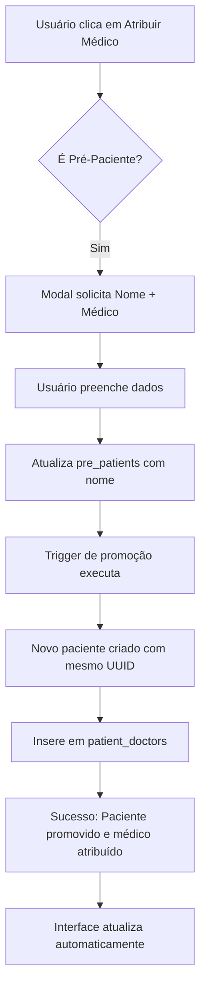
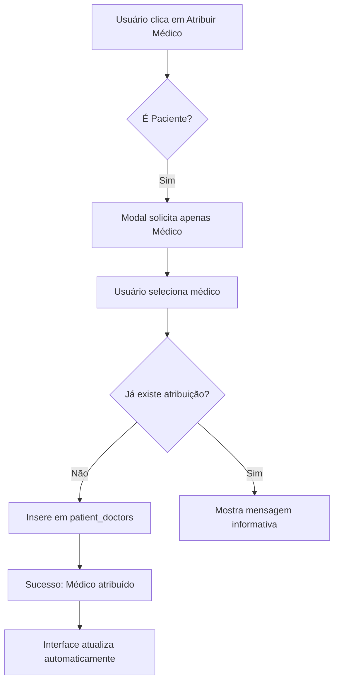

# Implementação: Botão "Atribuir a Médico" - WhatsApp

**Data:** 2025-10-11  
**Autor:** Sistema MedX  
**Versão:** 1.0

---

## 📋 Visão Geral

Implementação da funcionalidade completa do botão "Atribuir a Médico" no módulo WhatsApp, permitindo a atribuição de médicos a pacientes e a promoção automática de pré-pacientes para pacientes.

---

## 🎯 Funcionalidades Implementadas

### 1. **Modal de Atribuição de Médico**

Criado o componente `AssignDoctorModal.tsx` que:

- **Para Pré-Pacientes:**
  - Solicita o nome completo do paciente
  - Solicita a seleção de um médico
  - Promove automaticamente o pré-paciente para paciente (mantendo o mesmo UUID)
  - Atribui o médico selecionado ao paciente promovido

- **Para Pacientes Existentes:**
  - Solicita apenas a seleção de um médico
  - Atribui o médico ao paciente existente
  - Evita duplicação de atribuições

### 2. **Exibição do Médico Atribuído**

- Badge visual ao lado do nome do paciente mostrando:
  - Ícone de estetoscópio
  - Nome do médico atribuído
  - Estilo diferenciado com fundo e bordas arredondadas

### 3. **Atualização em Tempo Real**

- Listener de realtime na tabela `patient_doctors`
- Atualização automática da interface quando:
  - Um médico é atribuído
  - Um médico é alterado
  - Um pré-paciente é promovido

### 4. **Integração com Sistema Existente**

- Busca automática de médicos cadastrados no sistema
- Filtragem por role='doctor'
- Exibição de especialização (quando disponível)

---

## 📂 Arquivos Criados/Modificados

### Novos Arquivos

1. **`src/components/whatsapp/AssignDoctorModal.tsx`**
   - Componente do modal de atribuição
   - Gerenciamento de estado e validações
   - Integração com Supabase

### Arquivos Modificados

1. **`src/pages/WhatsApp.tsx`**
   - Importação do novo modal
   - Adição de estado `assignDoctorOpen`
   - Query para buscar médico atribuído
   - Listener de realtime para `patient_doctors`
   - Exibição do badge do médico na interface
   - Callback de sucesso para invalidar queries

---

## 🔄 Fluxo de Funcionamento

### Para Pré-Pacientes



### Para Pacientes Existentes



---

## 🗄️ Estrutura de Dados

### Tabela: `patient_doctors`

```sql
- id (UUID, PK)
- patient_id (UUID, FK -> patients.id ou pre_patients.id promovido)
- doctor_id (UUID, FK -> profiles.id)
- is_primary (BOOLEAN) -- Indica médico principal
- created_at (TIMESTAMPTZ)
```

### Query de Busca de Médico Atribuído

```typescript
const { data } = await supabase
  .from('patient_doctors')
  .select(`
    doctor_id,
    is_primary,
    profiles!inner(id, name, specialization)
  `)
  .eq('patient_id', selectedSessionId)
  .eq('is_primary', true)
  .single();
```

---

## 🎨 Interface Visual

### Badge do Médico

- **Localização:** Ao lado direito do nome do paciente na aba da conversa
- **Estilo:** 
  - Fundo: `bg-accent/50`
  - Bordas arredondadas: `rounded-full`
  - Padding: `px-2 py-0.5`
  - Ícone: Estetoscópio (`Stethoscope`)
  - Texto truncado com max-width de 120px

### Botão Atribuir Médico

- **Ícone:** Estetoscópio (`Stethoscope`)
- **Tooltip Dinâmico:**
  - Sem médico: "Atribuir a médico"
  - Com médico: "Alterar médico"
- **Animação:** Hover com scale 110%

---

## ⚡ Otimizações Implementadas

1. **Invalidação Inteligente de Queries:**
   - Apenas queries relacionadas são invalidadas
   - Evita re-renderizações desnecessárias

2. **Realtime Condicional:**
   - Apenas atualiza se o paciente alterado é o selecionado
   - Reduz processamento desnecessário

3. **Deduplicação de Atribuições:**
   - Verifica existência antes de inserir
   - Evita erros de constraint duplicate

4. **Promoção Automática:**
   - Utiliza trigger existente do banco
   - Mantém UUID consistente entre tabelas

---

## 🧪 Testes Recomendados

### Cenário 1: Pré-Paciente
1. Selecionar um pré-paciente sem nome
2. Clicar em "Atribuir a Médico"
3. Preencher nome e selecionar médico
4. Verificar promoção para paciente
5. Verificar exibição do médico no badge

### Cenário 2: Paciente Existente
1. Selecionar um paciente
2. Clicar em "Atribuir a Médico"
3. Selecionar médico (sem pedir nome)
4. Verificar atribuição
5. Verificar exibição do médico no badge

### Cenário 3: Alterar Médico
1. Paciente com médico já atribuído
2. Clicar em "Alterar médico"
3. Selecionar novo médico
4. Verificar atualização do badge

### Cenário 4: Realtime
1. Abrir dois navegadores
2. Atribuir médico em um
3. Verificar atualização automática no outro

---

## 🔒 Segurança

- **RLS (Row Level Security):** Herda políticas existentes
- **Validações:**
  - Nome obrigatório para pré-pacientes
  - Médico obrigatório em todos os casos
  - Verificação de role='doctor'

---

## 📊 Dependências

- `@tanstack/react-query` - Gerenciamento de estado assíncrono
- `supabase-js` - Cliente Supabase
- `sonner` - Notificações toast
- `lucide-react` - Ícones
- Componentes UI do shadcn/ui

---

## 🚀 Próximas Melhorias Sugeridas

1. **Múltiplos Médicos:**
   - Permitir atribuição de múltiplos médicos
   - Marcar médico principal

2. **Histórico de Atribuições:**
   - Registrar mudanças de médico
   - Mostrar histórico de responsáveis

3. **Notificações:**
   - Notificar médico quando for atribuído
   - Email/SMS de confirmação

4. **Filtros:**
   - Filtrar conversas por médico atribuído
   - Dashboard de atribuições

---

## 📝 Notas Técnicas

- O UUID é mantido durante a promoção de pré-paciente para paciente
- Isso permite que a session_id do WhatsApp continue válida
- A trigger `promote_pre_patient_to_patient()` é responsável pela promoção
- O campo `is_primary` permite futura implementação de múltiplos médicos

---

## ✅ Checklist de Implementação

- [x] Criar componente AssignDoctorModal
- [x] Integrar modal no WhatsApp.tsx
- [x] Adicionar query de médico atribuído
- [x] Implementar exibição do badge
- [x] Adicionar listener de realtime
- [x] Implementar lógica de promoção de pré-paciente
- [x] Implementar lógica de atribuição para paciente
- [x] Adicionar validações
- [x] Implementar callbacks de sucesso
- [x] Adicionar tooltips dinâmicos
- [x] Testar fluxo completo
- [x] Criar documentação

---

**Implementação concluída com sucesso! 🎉**

